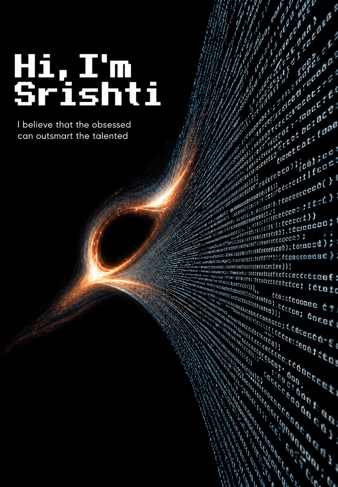

  

<h2 align="center">WHO AM I</h2>

  I'm Srishti — a developer exploring the intersection of Artificial Intelligence, cybersecurity, and software development.
  I enjoy understanding how systems work, building intelligent applications, and exploring how AI can be made more secure.

<h2 align="center">WHAT I DO</h2>

  I build intelligent applications and explore the systems behind them.
  My focus spans Generative AI, Agentic AI, LLMs, RAG, and AI security —
  while building the foundations needed to turn ideas into working systems.

<h2 align="center">VISION</h2>

  I want to build technology that is not only intelligent, but secure.
  My goal is to explore the boundaries of AI, understand the systems behind it,
  and create things that are useful, meaningful, and built to last.

<h2 align="center">SKILL SET</h2>

<h3>LANGUAGES</h3>

Python · C++ · JavaScript · SQL · Bash

<h3>AI / ML</h3>

Generative AI · Agentic AI · LLMs · RAG · NLP · Deep Learning

<h3>AI SECURITY</h3>

LLM Security · Prompt Injection · AI Red Teaming

<h3>AI INFRASTRUCTURE</h3>

LangChain · LangGraph · pgvector · Redis

<h3>BLOCKCHAIN</h3>

Blockchain · Smart Contracts · Cryptography

<h3>FRONTEND</h3>

HTML · CSS · JavaScript

<h3>TOOLS</h3>

Git · Linux · FastAPI · Docker
