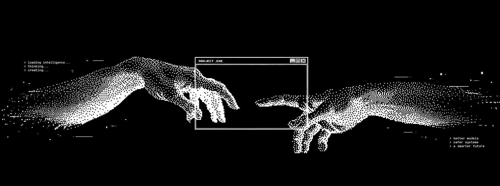

<p align="center">
  
</p>
<!-- 1. KEEP YOUR EXISTING BANNER: paste your current banner image line here -->
<!-- It looks like:  -->

<div align="center">


*"I believe that the obsessed can outsmart the talented."*

</div>

---

<h2></h2>


<h2></h2>


<h2></h2>


### `> currently`

```text
building  : Something Intresting
learning  : Something New
reading   : The Alchemist
```

---

### `> stack`

**Languages**<br>


**AI / ML**<br>


**AI Security**<br>


**AI Infrastructure**<br>


**Blockchain**<br>


**Frontend**<br>


**Tools**<br>


### `> stats`

<div align="center">


</div>

---


```text
> Trained on curiosity. fine-tuned by obsession.
```
